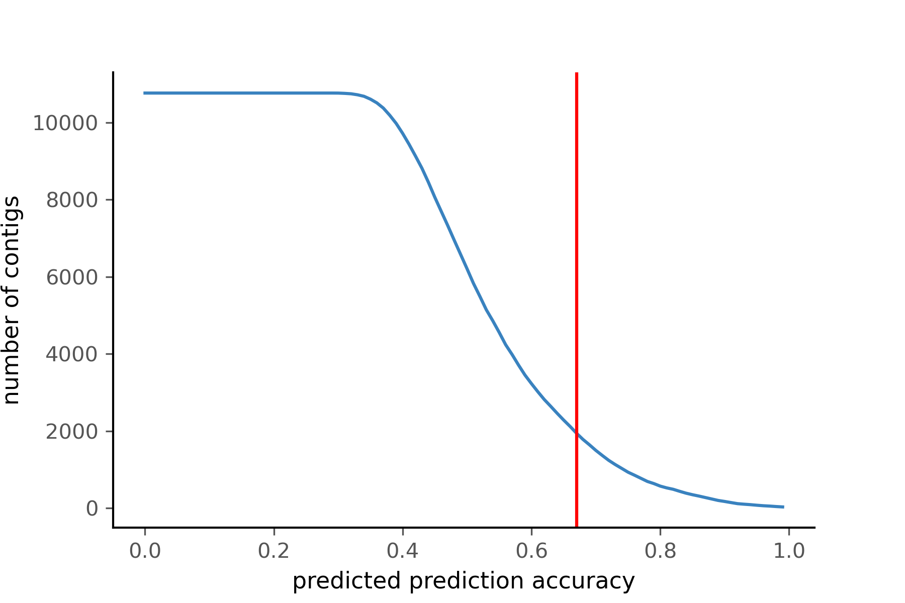
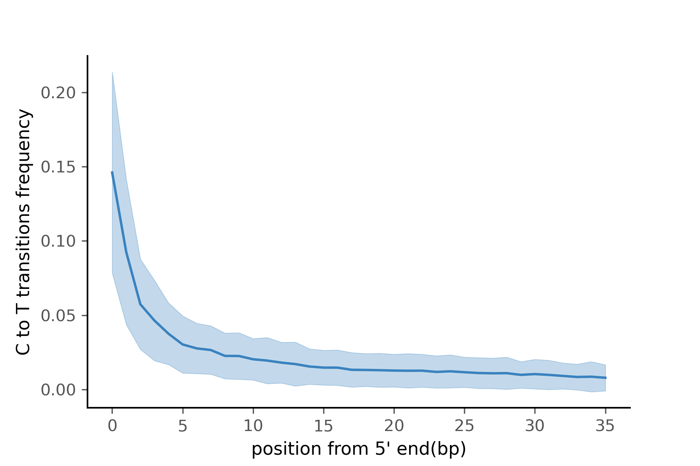
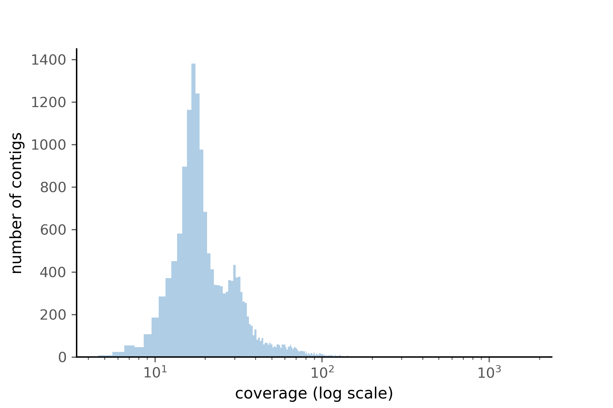

# PyDamage: automated ancient damage identification and estimation for contigs in ancient DNA

This repository contains the code to reproduce the figure and analysis of the article describing the [PyDamage](https://github.com/maxibor/pydamage) software.

The article ~~is~~ will be available at [TODO: insert article link once published]

## Abstract

>DNA *de novo* assembly can be used to reconstruct longer stretches of DNA (contigs), including genes and even genomes, from short DNA sequencing reads. Applying this technique to metagenomic data derived from archaeological remains, such as paleofeces and dental calculus, we can investigate past microbiome functional diversity that may be absent or underrepresented in the modern microbiome gene catalogue. However, compared to modern samples, ancient samples are often burdened with environmental contamination, resulting in metagenomic datasets that represent mixtures of ancient and modern DNA. The ability to rapidly and reliably establish the authenticity and integrity of ancient samples is essential for ancient DNA studies, and the ability to distinguish between ancient and modern sequences is particularly important for ancient microbiome studies. Characteristic patterns of ancient DNA damage, namely DNA fragmentation and cytosine deamination (observed as C-to-T transitions) are typically used to authenticate ancient samples and sequences, but existing tools for inspecting and filtering aDNA damage either compute it at the read level, which leads to high data loss and lower quality when used in combination with *de novo* assembly, or require manual inspection, which is impractical for ancient assemblies that typically contain tens to hundreds of thousands of contigs. To address these challenges, we designed PyDamage, a robust, automated approach for aDNA damage estimation and authentication of *de novo* assembled aDNA. PyDamage uses a likelihood ratio based approach to discriminate between truly ancient contigs and contigs originating from modern contamination. We test PyDamage on both on simulated aDNA data and archaeological paleofeces, and we demonstrate its ability to reliably and automatically identify contigs bearing DNA damage characteristic of aDNA. Coupled with aDNA *de novo* assembly, Pydamage opens up new doors to explore functional diversity in ancient metagenomic datasets.

### Figure 1

- code: [scripts/simulation_scheme.R](scripts/simulation_scheme.R)

### Figure 2

- code: [scripts/Pydamage_plotting.R](scripts/Pydamage_plotting.R)

### Figure 3

- code: [scripts/Pydamage_plotting.R](scripts/Pydamage_plotting.R)

### Figure 4

- code: [scripts/Pydamage_plotting.R](scripts/Pydamage_plotting.R)

## Figure 5

- code: [scripts/prokka/analyse_prokka.ipynb](scripts/prokka/analyse_prokka.ipynb)

### Figure 6

- Generated with [Pavian](https://github.com/fbreitwieser/pavian)

### Figure 7

- code: [scripts/prokka/analyse_prokka.ipynb](scripts/prokka/analyse_prokka.ipynb)

### Figure 8

- code [scripts/notebooks/coverage_distribution.ipynb](scripts/notebooks/coverage_distribution.ipynb)

